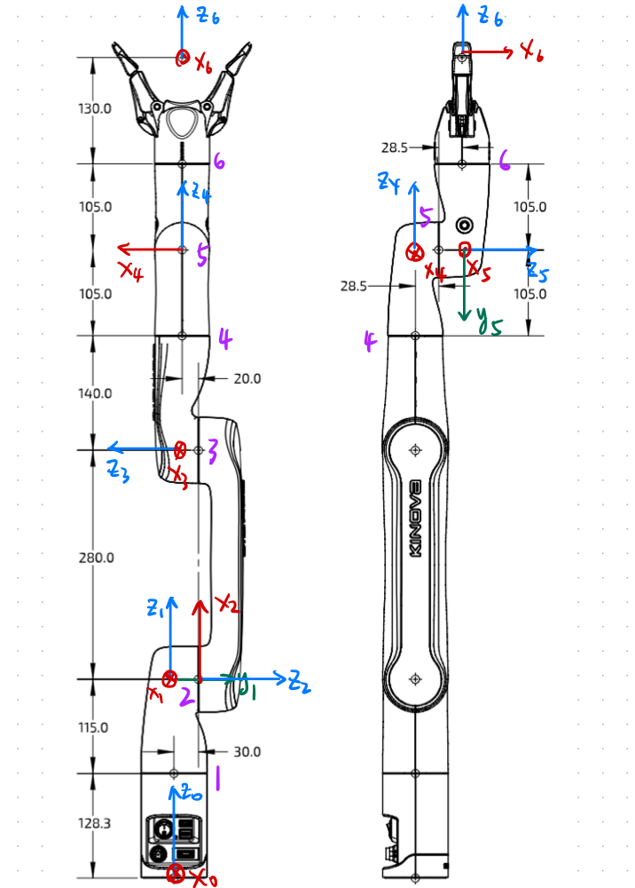

## The Axis is defined as follows

---
### DH Table
| Links | \alpha_{i-1} | a_{i-1} | \theta_i | d_i
| -- | -- | -- | -- | -- |
|1| 0 | 0 | \theta_1 | 243.3 |
|2| 90 | 0 | 90 + \theta_2 | 30 |
|3| 180| 280 | 90 + \theta_3 | 20 |
|4| 90 | 0 | 90 + \theta_4 | 245 |
|5| 90 | 0 | 180 + \theta_5 | 57 |
|6| 90 | 0 | 90 + \theta_6 | 235 |

Notice that the `x` in theta colomn's `x + \theta_i` means the initial angle.
